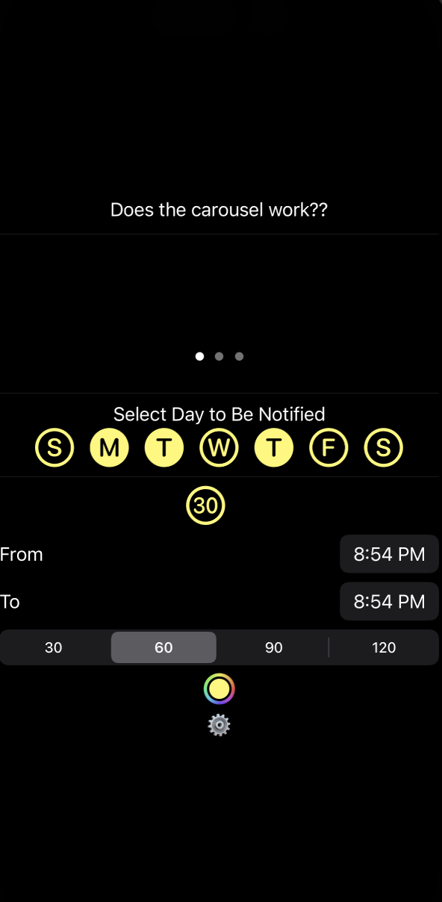
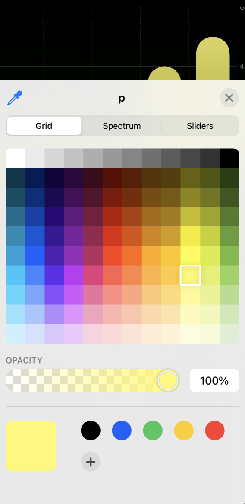
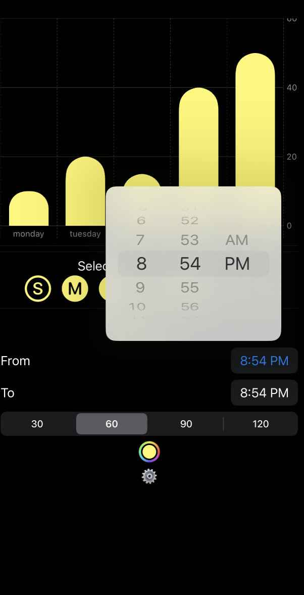

# StandAid

<h3>Summary</h3>

StandAid is an app I worked on during challenge 2 at the Apple Developer Academy. It's for people who live sedentary lifestyles--so, just about everyone. It all starts with standing up, so StandAid allows the user to schedule custom reminders to get up, go outside, strech, etc. It is similar to a feature built into the Apple Watch, except it works without an Apple Watch and allows full customization.

<h3>What I Learned</h3>
<ul>
<li>How to use a UIColorPicker to create a custom color settings.</li>
<li>Implemented Notifications (still more to learn on that one!).</li>
<li>Created a multiple choice picker!</li>
<li>How to make a carousel view.</li>
<li>Used a new framework: Charts!</li>
<li>How to display a time picker.</li>
<li>How to work with a team of opposing work styles.</li>
</ul>

<h3>What I'd Do Next</h3>
I'm entirely sure if I'll continue working on this project, but if I did...
<ul>
<li>Setup custom notification message feature.</li>
<li>Finish logic for regular interval notifications.</li>
<li>Tie bar graph information to Health data from the user.</li>
</ul>
